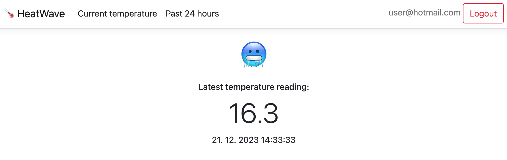
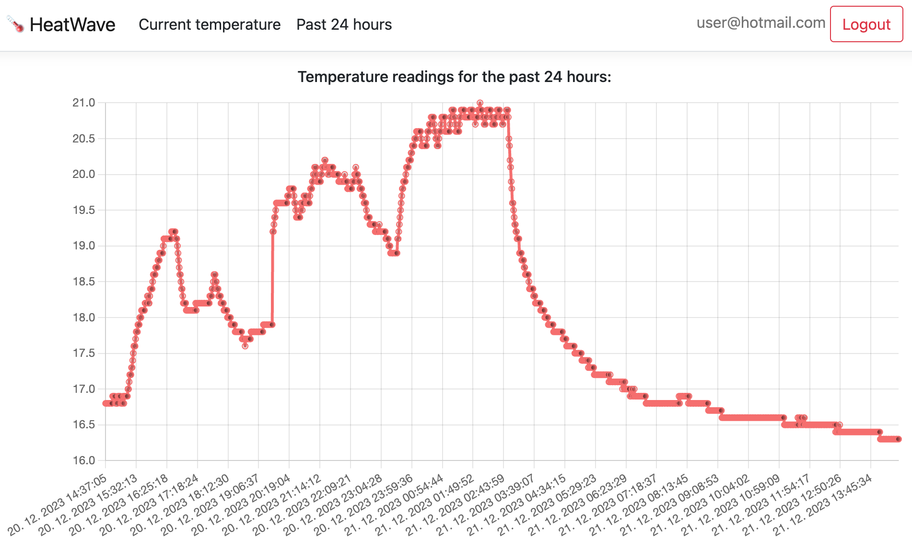

## ASP.NET Core application for displaying temperature readings

An example of a simple ASP.NET Core application which fetches temperature readings from an Azure function app and displays them.

**Note:** This is a continuation of the [Temperature telemetry Azure function app](https://github.com/tomazzazijal/iot-temp-azure-function-app).

**The application uses a system-assigned managed identity to access data from the Azure function app.**

### Pre-requisites

- Azure setup (most will be automated - _soon™_):
  - Subscription
  - Resource group
  - App Service plan
  - Entra ID application for authentication with this webapp
- Azure CLI
  - User logged in
- Dotnet SDK 7.0

### Required secrets

An `app/appsettings.json` file should be created in the following fashion:

```
{
  "Logging": {
    "LogLevel": {
      "Default": "Information",
      "Microsoft.AspNetCore": "Warning"
    }
  },
  "AllowedHosts": "*",
  "AzureAd": {
    "Instance": "https://login.microsoftonline.com/",
    "TenantId": "[tenant_id]",
    "ClientId": "[client_id]",
    "CallbackPath": "/signin-oidc",
    "SignedOutCallbackPath": "/signout-oidc"
  },
  "TemperatureSource": {
    "AzureAPIScope": "[scope_of_an_exposed_entra_id_application_of_the_azure_function_app]"
  },
  "Localization": {
    "Timezone": "CET"
  }
}
```

### Usage

Once pre-requisites are setup, run `just app-deploy`.

The following pages are currently available:

- /current:

  

- /history

  
